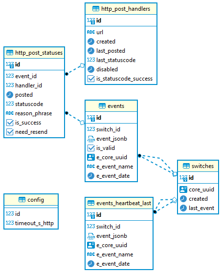

# Esl2Http
FreeSWITCH Esl2Http cross-platform adapter microservice

         Each layer is into its own thread, into the thread loop

        +---+--------------+------------------+------------------+
        | E | EVENTS       | POST             | RESEND           |
        | S | PERSISTER    | TO THE           | TO THE FAILED    |
        | L | TO THE       | HTTP HANDLERS    | HTTP HANDLERS    |
        | --+--------------+ SELECTING FROM   | SELECTING FROM   |
        | C | MEMORY QUEUE | THE DATABASE     | THE DATABASE     |
        | L +--------------+                  |                  |
        | I | DATABASE     | HANDLER 1 THREAD | HANDLER 1 THREAD |
        | E | TABLE        | HANDLER 2 THREAD | HANDLER 2 THREAD |
        | N |              |     ...          |     ...          |
        | T |              | HANDLER N THREAD | HANDLER N THREAD |
        +---+--------------+------------------+------------------+

#### Preface
<p align="justify">
First of all I would like to thank ImpacTech for the interesting task to design and to develop the software with using of a modern technologies in a field of VoIP. Hope it could be started well according I've tested to deploy it into a different environments (ARM Linux x32 host under Raspberry Pi, Docker Desktop on Windows 10 x64 with Windows Subsystem for Linux)
</p>

I have used my own FreeSWITCH 1.10 to test, the latest production release.

<p align="justify">
Both containers are under Alpine Linux - the most lightest Linux. Dockerfiles contain a little number of layers as little as possible. The microservice is Linux executable, made as a cross-platform application (can be compiled to Windows executable as well) with using of .net 5, building from the sources when the Docker Image is building, that makes possible to hard-code into the assembly for security purposes the most critical credentials - ESL password and the FreeSWITCH ESL host and port, to avoid to leak it by DevOps engineers or anybody who are not authorized to have ESL access there.
</p>

I've used Visual Studio 2022 IDE to write the code.

Some key points of the microservice design:
- Containers must be as little as possible, with as little as possible numbers of layers;
- Asynchronious design is required, to minimize blocking on high-load, to avoid performance degradation;

  - SOLID principes. For example:
  - SingleResponsibility, to avoid monolith of microservice/HTTP handlers, decomposition of tasks;
  - OpenClosed: layered design, able to extend in a future;
  
 - Avoid a lot of text logs, they are unreadable. Rich database design instead of text logs;
 - `HEARBEAT` - is the most important FreeSWITCH event. The microservice subscribes on it always on start, logs it to `SDTOUT` and persists to the database as the last received `HEARTBEAT`;
 - `STDOUT` logs should be as much as readable are be clear to understand what is going on;
 - Received ESL events should not be lost, they should be sent in order according the event time containing into it;
 - <p align="justify">Integrity is not guaranteed on the incoming ESL TCP stream, some data could be lost (possible this is network buffer and performance issue) during the continious events receiving. It was a very strange but reproduced only inside the Docker container, and not into debugger on IDE (it could be reproducible only if to stay a long time into the breakpoint, while the data arrived and nothing read it) So after the blind fix, with understanding the reason - it never reproduced it after.

Also, a different behavior in Dockerfile-postgres with VOLUME is reproduced when I build it under Docker Desktop and under regular Docker under Linux.
This image is built successfully with docker desktop, but with regular docker on Linux, even when the docker versions are the same - built with an error:
postgres could not to create database directory. No files were after it was built. The fix was to declare VOLUME in the docker file right after all the data are saved
to the destination, and after to mount the volume (you can check the history of that file)

#
#### Repository structure


Docker related files (including Docker file for the micro-service)
There're Dockerfiles, docker-compose .yaml files, docker compose shell/command files, single docker container shell/command files to delete, build, run, attach and stop containers (i.e. for test purposes - to create and to start just a Postgres container, and to connect to the database from DBeaver or from the microservice that is under debug on IDE)
#


Postgres related files (including database implementation)
Server configuration files that are copied by `Dockerfile-postgres`, and SQL scripts that are executed by `Dockerfile-postgres` as well. Endpoints are stored into `Init/init_http_post_handlers.sql`
```sql
INSERT INTO http_post_handlers(url) VALUES('https://ptsv2.com/t/1fnkf-1627122772/post');
INSERT INTO http_post_handlers(url) VALUES('https://ptsv2.com/t/lxlxm-1627287724/post');
INSERT INTO http_post_handlers(url) VALUES('https://ptsv2.com/t/iev4l-1627303429/post');
```
It's very easy to copy/paste to a new string to add a new endpoint before creating Postgres container image, if required (as well as to use a separate CRUD UI that is out of scope) Global configuration values that are possible to store into the database are into `Init/init_config.sql` For now there's only `timeout_s_http` - HTTP connection timeout (in seconds) read on microservice startup. Default is 100, that is default by default.
#


Microservice source code. There're 2 assemblies: microservice executable, and microservice secrets. This is for security purposes, to avoid ESL credentials leak by the persons who can maintain this microservice, but must not have an access to the ESL credentials. To avoid fraud, especially IPRN fraud (to connect to ESL, to type something like `bgapi originate sofia/external/iprn_1_dollar_per_minute@regular_termination_provider &park` a lot of time and enjoy the account balance 😁) So, by design, one microservice can be connected to one FreeSWITCH only (but it's possible to extend, for now it's out of scope) and the image is given to DevOps after it built. Next - DevOps can maintain the container, based on the ready image, without knowing the credentials of how to connect to the FreeSWITCH box. This is very simple: just need to type the credentials into the source code `Esl2Http.Private/Secrets.cs`
```c#
        public const string CONST_SECRETS_EslHostPort = "esl_host[:port]";
        public const string CONST_SECRETS_EslPassword = "esl_password";
```
They are empty by default and must be provided with the valid data. On syntax error the microservice image will not be built. So, the microservice binaries are build from the sources on image creation, handling ESL credentials inside the assembly. Please check the `Dockerfile-esl2http` for more information.

#
#### Database design


- Self-documented datatables and columns (I think);
- The tables structure tends to the 1st normal form, to split the entities, that are unique;
- Foreign keys, check constraints, unique constraints - to provide the data integrity;
- All the timestamps are in UTC;
- `e-` columns are generated columns with parsed event values from `event-jsonb`;
- `e-event-date` contains the primary event date in UTC, generated from Unix timestamp;
- If `event_jsonb` contains not valid json (i.e. received as malformed) then 'e-' fields parsed as `null`;
- If any `e-` column `is null` then `is_valid` column is false;
- **I forgot to create the column events_heartbeat_last.is_valid, just for information purposes;**
- *Update: if we successfully read JSON properties of the event - the event is valid by default, so if we read that it was `HEARTBEAT` to insert into `events_heartbeat_last` - the event is valid by default, and need no `column events_heartbeat_last.is_valid.*

'Right ideas come later' - a proverb.

_As a usually I do prefer to create indexes on each fields for a future extentions. In a little tables indexing cost on insert/update/delete is almost nothing. But if to create an index in a future, when a lot of rows - it could be too expensive with locking, even if Postgres can provide two steps of indexing._

The datatables are:

- `switches` - FreeSWITCH boxes. Unique by core_uuid, even if the column value changes on switch restart;
- `event_heartbeat_last` - the last received `HEARTBEAT` event, unique by the switch;
- `http_post_handlers` - unique endpoints to post events;
- `events` - events received and persisted to the database;
- `http_post_statuses` - references to the event referenced by the posted endpoint (unique, this is an entity). To repost - need to update `need_resend` to `true` where `is_success` is false. Or to delete the records there.
- `config` - single row table, read on the microservice startup.

#
#### Resend failed webhooks policy

Failed webhooks (HTTP post statuscode rather than 2xx or throwed exception on post) is an exceptional case that is not a normal flow. Should we resend events to the handlers by auto if i.e. 404 (not found) response? I don't think so, taking into account that it could be a typo into the URL of the handler. Should we auto resend-resend-resend and to throttle the endpoint if 5xx server error? I think no. I see no cases when it should be recovered by auto. I think in this case the microservice should stop to send events to the failed endpoints, and provide a notification that this exceptional situation is on.

Each event posts to the endpoint in parallel, into its own thread, for a higher performance. Even using parallel sending, mixing sending to working endpoints and auto resend to the failed endpoints we are in risk that resends will stuck sending to working endpoints.

After the endpoint problem is gone it's possible to resend the failed events by default by manually. Please check `ProjectFiles/Postgres/SQL/Other/example-resend.sql`:

```sql
-- This is an example how to apply to send events to the failed http handler

DO
LANGUAGE plpgsql
$$
DECLARE
    _handler_id int;
BEGIN
    CALL usp_events_set_to_resend('https://ptsv2.com/t/iev4l-1627303429/post', _handler_id);
    RAISE NOTICE '_handler_id: %', _handler_id;
END;
$$
```

of cause, it's possible to extend by the SQL procedure called on schedule by Cron to mark events to resend, if this default behavoir is not suitable.

`psql -U esl2http -d esl2http -f sql_script_to_call_set_to_resend.sql`

If event is resent then the request to the handler will include HTTP header: `X-Esl2http-This-Is-Resend` with the value `1`

Also, the handler should check event datetime, if there's a policy concerning stall events (i.e. do we need to post after i.e. 3 days received them?)

#
#### Housekeeping

Possible yes. How many days do you need to store the events into the database? For logging purposes, to resend to failed webhooks. Cron SQL procedure call could help.
         
#
#### Content to post to the HTTP handlers

_The service should parse the events and post json contents as they described in Part 2. You can make any assumptions about the transformation rules and you can mention them in the Readme file._
         
Sorry, I'm totally disagree. This is design gap and SOLID violation. It is very important to post JSON event to handlers AS IS, without any data transformation (moreover, the data structure your provided is the part of CDR and not the events) to avoid esl2http/all_the_handlers monolith, to avoid to deploy changes in the same time for all the microservice/handlers, to avoid handler http errors if the data transformation is changed.  Data transformation depends on business rules. Business rules are changeable. For example, what is the event property is to store under 'UUID'? Is it `CORE-UUID`? Yes, it makes sence, this is `UUID` of the switch, that changes after restart. Or may be to store there `UUID` of the leg? It make sence too, because we can call `bgapi uuid_transfer <uuid> <destination>` to spy on the call. So, business rules are changeable, system is not in static statement, but event properties are not. Handler should get a native event information that the handler requires. It covers everything. We can have a different handlers that consume a different properties of the event. A new handlers can be created, the properties to read on existing handlers can be changed. Anyway - the different handlers can read a different event properties, and need to avoid tight coupling, need to do the decomposition of responsibilities, need to remember about design patterns, best practices, SOLID and experience. This is just an unidirectional adapter. That transforms ESL channel to HTTP and no more.In my humble opinion. But if we need tight coupling between the microservice and every handlers - just need to do a little fix into `HttpPostWorker` and `HttpRepostWorker`, and in this case the Customer is responsible for the risk of degradation of the system and takes an obligation to provide the data transformation rules to the Developer, according this is a business rules, that could be different interpreted and not the technical knowledges.
         
p.s. Thinking after some time - the data transformation is possible to implement, but in context of each concrete handler. It can prevent tight coupling and also makes Single Responsibility in context of the each handler too, instead of a single data transformation for all handlers. Anyway, the events are stored into the database as is. It's possible to apply data transformation for each handlers as required, i.e. do not send some properties if needed.
         
#
#### Before you begin

Before you begin please check your ESL access to the FreeSWITCH host, and please check your HTTP handlers where ESL events to be posted. For test purposes I've used [ptsv2.com - Post Test Server V2](https://ptsv2.com/). You can get there as much handlers as you can, and even to define there HTTP response status code. The pre-configured HTTP handlers used into the default configuration are:

- [https://ptsv2.com/t/1fnkf-1627122772/post](https://ptsv2.com/t/1fnkf-1627122772)
- [https://ptsv2.com/t/lxlxm-1627287724/post](https://ptsv2.com/t/lxlxm-1627287724)
- [https://ptsv2.com/t/iev4l-1627303429/post](https://ptsv2.com/t/iev4l-1627303429)

On Docker image creation the default HTTP handlers are inserted to the `http_post_handlers` table by the SQL script (see below)
During the microservice is working you can insert any HTTP handlers into the `http_post_handlers` table, and the unsent events will be posted ASAP.

`A HACK:` ptsv2.com is a nice service to test HTTP posts, but has an undocummented limitation to the receiving length of data and returns InternalServerError if to test to post events there. According I've no control with it, I did a hardcode into the code:
```c#
// A hack to avoid Internal Server Error on the test environment.
// Not for production.
// Just to avoid remote settings of the max. request length.
// A hard hack
req.Content = new StringContent(
    req.RequestUri.Host == "ptsv2.com" ? EventToPost.Item2.Substring(0, 1500) : EventToPost.Item2,
    Encoding.UTF8, "application/json");
```
Of cause, in Production environment HTTP handlers must allow to receive data with length according plain JSON event length (i.e. 4096 bytes, as the default network buffer size)
I will explain later why it should be.

**So, test ESL first, and try to conversate with the FreeSWITCH by manually:**

I assume that you already have FreeSWITCH with configured inbound ESL access.

1. Open you favorite Telnet client (i.e. [XShell](https://www.netsarang.com/en/free-for-home-school/)) and connect to the ESL port;
2. Do authorization: type `auth <esl_password>` **[enter] [enter]**;
3. Wait for positive response or FreeSWITCH will terminate the session on wrong password / ACL rules;
4. Subscribe to `HEARTBEAT` event: type `event json heartbeat` **[enter] [enter]**;
5. Enjoy `HEARTBEAT` events that are sending every 20 seconds;
```c
  202 SWITCH_STANDARD_SCHED_FUNC(heartbeat_callback)
  203 {
  204         send_heartbeat();
  205 
  206         /* reschedule this task */
  207         task->runtime = switch_epoch_time_now(NULL) + 20;
  208 }
```
6. Type `exit` **[enter] [enter]** to finish the session.

If you successfully passed the steps above - you can configure and build the microservice.
  
#
#### Microservice configuration:
  
1. ESL access: `Esl2Http.Private/Secrets.cs`
```c#
        public const string CONST_SECRETS_EslHostPort = "esl_host[:port]";
        public const string CONST_SECRETS_EslPassword = "esl_password";
```
2. HTTP endpoints to post: `Init/init_http_post_handlers.sql`
```sql
INSERT INTO http_post_handlers(url) VALUES('https://ptsv2.com/t/1fnkf-1627122772/post');
INSERT INTO http_post_handlers(url) VALUES('https://ptsv2.com/t/lxlxm-1627287724/post');
INSERT INTO http_post_handlers(url) VALUES('https://ptsv2.com/t/iev4l-1627303429/post');
```
3. Global configuration values: `Init/init_config.sql` For now there's only `timeout_s_http` - HTTP connection timeout (in seconds) read on microservice startup. Default is 100, that is default by default.
         
4. Environment variables: file `esl2http.env`
  
`esl2http_DBConnectionString`=Host=postgres;Username=esl2http;Password=esl2http;Database=esl2http
  
`esl2http_EslRxBufferSize` - ESL TCP RX buffer size (4096 bytes by default, do not change it if events receives correctly)
  
`esl2http_EslEventsToSubscribe` - ESL events to subscribe, by defaul are `CHANNEL_ORIGINATE CHANNEL_ANSWER CHANNEL_HANGUP` with always prepended `HEARTBEAT`

_All available SQL connection string parameters please see at (https://www.npgsql.org/doc/connection-string-parameters.html)_
  
#
#### To start the microservice (including Docker compose file that will include the micro-service and the database)

To start the microservice:

- use esl2http.yaml, esl2http-raspi.yaml
- or use /ProjectFiles/Docker/ ordered folders and ordered shell/command files
 
 The thing is I do not know your Docker production environment. My Docker production environment on Linux was under ARM Linux on Raspberry Pi, on Windows was Docker-Desktop with WSL2 under Windows 10 x64 The regulat Dockerfile- didn't tested on regular Linux, but I believe it should work.
         
p.s. 
> The endpoints of the external application/system will be called by the micro-service using the POST method.
         
Of cause the POST verb. According the REST principes (a new item that changes the state)
  
  Thank you, and good luck!
  
  Best regards,
         
  Anton Lozovskyi
         
p.s. Sorry for typos - it was nice 3 weeks to design and to develop non stop.
         
p.p.s. - sorry, no to squash commits is available for online GIT
  #
 Copyright © by Anton Lozovskyi, 2021
