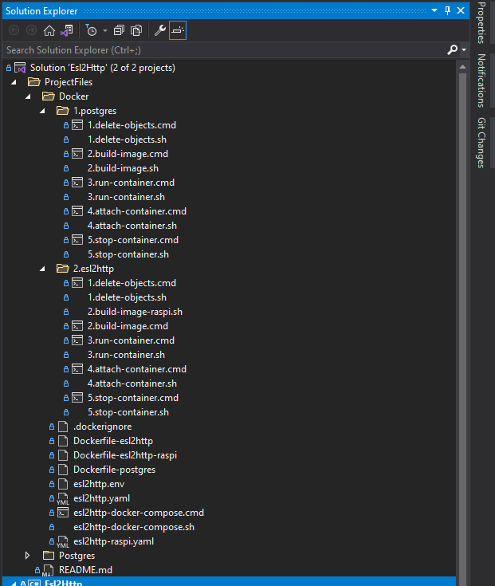
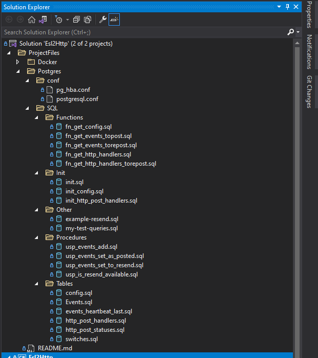
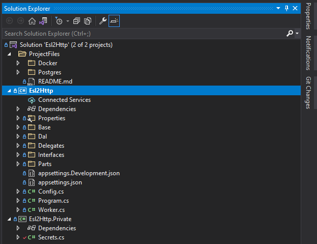

# Esl2Http
FreeSWITCH Esl2Http cross-platform adapter microservice

#### Preface
<p align="justify">
First of all I would like to thank ImpacTech for the interesting task to design and to develop the software with using of a modern technologies in a field of VoIP. Hope it could be started well according I've tested to deploy it into a different environments (ARM Linux x32 host under Raspberry Pi, Docker Desktop on Windows x64 with Windows Subsystem for Linux)
</p>

I have used my own FreeSWITCH 1.10 to test, the latest production edition.

<p align="justify">
Both containers are under Alpine Linux - the most lightest Linux. Dockerfiles contain a little number of layers as little as possible. The microservice is Linux executable, made as a cross-platform application (can be compiled to Windows executable as well) with using of .net 5, building from the sources when the Docker Image is building, that makes possible to hard-code into the source code for security purposes the most critical credentials - ESL password and the FreeSWITCH ESL host and port, to avoid to leak it by DevOps engineers or anybody who are not authorized to have ESL access there.
</p>

Some key points of the microservice design:
- Containers must be as little as possible, with as little as possible numbers of layers;
- Asynchronious design is required, to minimize blocking on high-load, to avoid performance degradation;

  - SOLID principes. For example:
  - SingleResponsibility, to avoid monolyth of microservice/HTTP handlers, decomposition of tasks;
  - OpenClosed: layered design, able to extend in a future;
  
 - Avoid a lot of text logs, they are unreadable. Rich database design instead of text logs;
 - `HEARBEAT` - is the most important FreeSWITCH event. The microservice subscribes on it always on start, logs it to `SDTOUT` and persists to the database as the last received `HEARTBEAT`;
 - `STDOUT` logs should be as much as readable are be clear to understand what is going on;
 - Received ESL events should not be lost, they should be sent in order according the event time containing into it;
 - <p align="justify">Integrity is not guaranteed on the incoming ESL stream, some data could be lost (possible, this is network buffer and performance issue) during the continious events receiving. It was a very strange but that reproduced only inside the Docker container, and not into debugger on IDE (it could be reproducible only if to stay a long time into the breakpoint, while data arrived and nothing read it) So after the blind fix, taking into account the reason - it never reproduced after.</p>


TODO TODO TODO
#
#### Repository structure

- Docker related files. There're Dockerfiles, docker-compose .yaml files, docker compose shell/command files, single docker container shell/command files to delete, build, run, attach and stop containers (i.e. for test purposes - to create and to start just a Postgres container, and to connect to the database from DBeaver or from IDE under debugger)
#

- Postgres related files.
Server configuration files that are deployed on Dockerfile, and SQL scripts that are executed on Dockerfile as well. Endpoints are stored into `Init/init_http_post_handlers.sql`
```sql
INSERT INTO http_post_handlers(url) VALUES('https://ptsv2.com/t/1fnkf-1627122772/post');
INSERT INTO http_post_handlers(url) VALUES('https://ptsv2.com/t/lxlxm-1627287724/post');
INSERT INTO http_post_handlers(url) VALUES('https://ptsv2.com/t/iev4l-1627303429/post');
```
It's very easy to copy/paste to a new string to add a new endpoint before creating Postgres container image, if required (as well as to use a separate CRUD UI that is out of scope) Global configuration values that are possible to store into the database are into `Init/init_config.sql` For now there's only `timeout_s_http` - HTTP connection timeout (in seconds) read on microservice startup. Default is 100, that is default by default.
#

- Microservice source code. There're 2 assemblies: microservice executable, and microservice secrets. This is for security purposes, to avoid ESL credentials leak by the persons who can maintain this microservice, but must not have an access to the ESL credentials. To avoid fraud, especially IPRN fraud (to connect to ESL, to type something like `bgapi originate sofia/external/iprn_1_dollar_per_minute@regular_termination_provider &park` a lot of time and enjoy the account balance 😁) So, by design, one microservice can be connected to one FreeSWITCH only (but this is possible to extend, for now this is out of scope) and one image is given to DevOps after it built. Next - DevOps can maintain the container, based on the ready image, without knowing the credentials of how to connect to the FreeSWITCH box. This is very simple: just need to type the credentials into the source code `Esl2Http.Private/Secret.cs`
```c#
        public const string CONST_SECRETS_EslHostPort = "esl_host[:port]";
        public const string CONST_SECRETS_EslPassword = "esl_password";
```
They are empty by default and must be typed. This is very simple, on syntax error the microservice image will not be built. So, the microservice binaries are build from the sources on image creation. Please check the `Dockerfile-esl2http` for more information.
#
#### Before you begin

Before you begin please check your ESL access to the FreeSWITCH host, and please check your HTTP handlers where ESL events to be posted. For test purposes I've used [ptsv2.com - Post Test Server V2](https://ptsv2.com/). You can get there as much handlers as you can, and even to define there HTTP response status code. The pre-configured HTTP handlers used into the default configuration are:

- [https://ptsv2.com/t/1fnkf-1627122772/post](https://ptsv2.com/t/1fnkf-1627122772)
- [https://ptsv2.com/t/lxlxm-1627287724/post](https://ptsv2.com/t/lxlxm-1627287724)
- [https://ptsv2.com/t/iev4l-1627303429/post](https://ptsv2.com/t/iev4l-1627303429)

On Docker image creation the default HTTP handlers are inserted to the `http_post_handlers` table by the SQL script (see below)
During the microservice is working you can insert any HTTP handlers into the `http_post_handlers` table, and the unsent events will be posted ASAP.

`A HACK:` ptsv2.com is a nice service to test HTTP posts, but has an undocummented limitation to the receiving length of data and returns InternalServerError if to test to post events there. According I've no control with it, I did a hardcode into the code:
```c#
// A hack to avoid Internal Server Error on the test environment.
// Not for production.
// Just to avoid remote settings of the max. request length.
// A hard hack
req.Content = new StringContent(
    req.RequestUri.Host == "ptsv2.com" ? EventToPost.Item2.Substring(0, 1500) : EventToPost.Item2,
    Encoding.UTF8, "application/json");
```
Of cause, in Production environment HTTP handlers must allow to receive data with length according plain JSON event length (i.e. 4096 bytes, as the default network buffer size)
I will explain later why it should be.

**So, test ESL first, and try to conversate with the FreeSWITCH by manually:**

1. Open you favorite Telnet client (i.e. [XShell](https://www.netsarang.com/en/free-for-home-school/)) and try to connect to the ESL port;
2. Do authorization: type `auth` `esl_password` **[enter] [enter]**;
3. Wait for positive response or FreeSWITCH will terminate the session on wrong password / ACL rules;
4. Subscribe to 'HEARTBEAT' event: type 'event json heartbeat' **[enter] [enter]**;
5. Enjoy 'HEARTBEAT' events that are sending every 20 seconds;
```c
  202 SWITCH_STANDARD_SCHED_FUNC(heartbeat_callback)
  203 {
  204         send_heartbeat();
  205 
  206         /* reschedule this task */
  207         task->runtime = switch_epoch_time_now(NULL) + 20;
  208 }
```
6. Type `exit` to finish the session.

If you successfully passed the steps above - you can configure and build the microservice.
